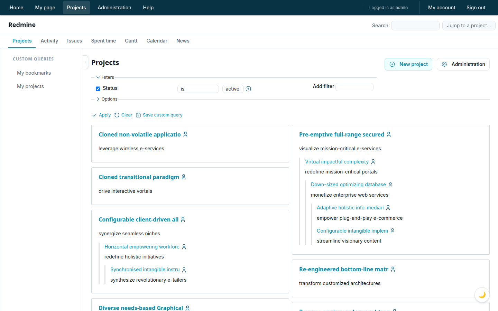
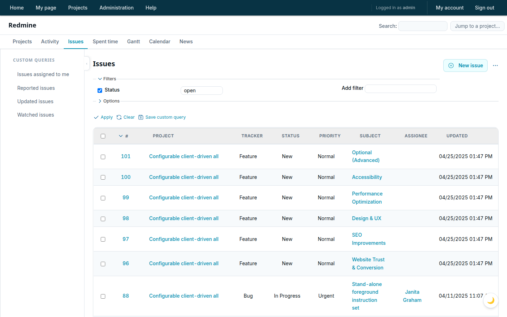
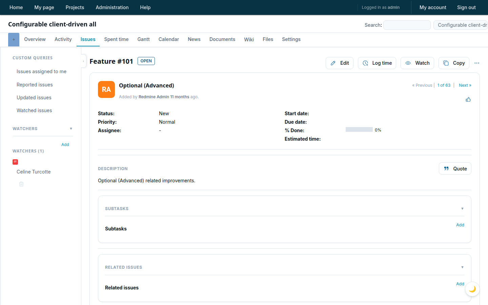
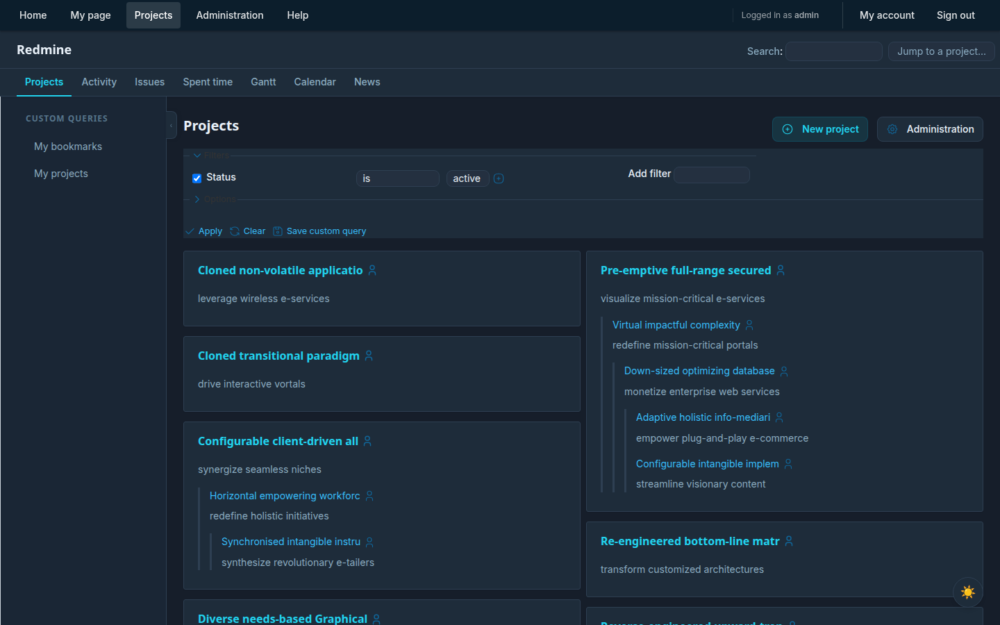
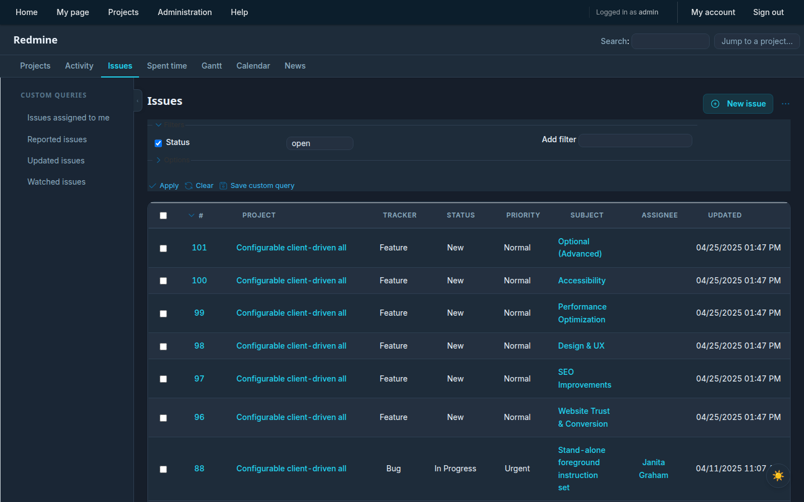
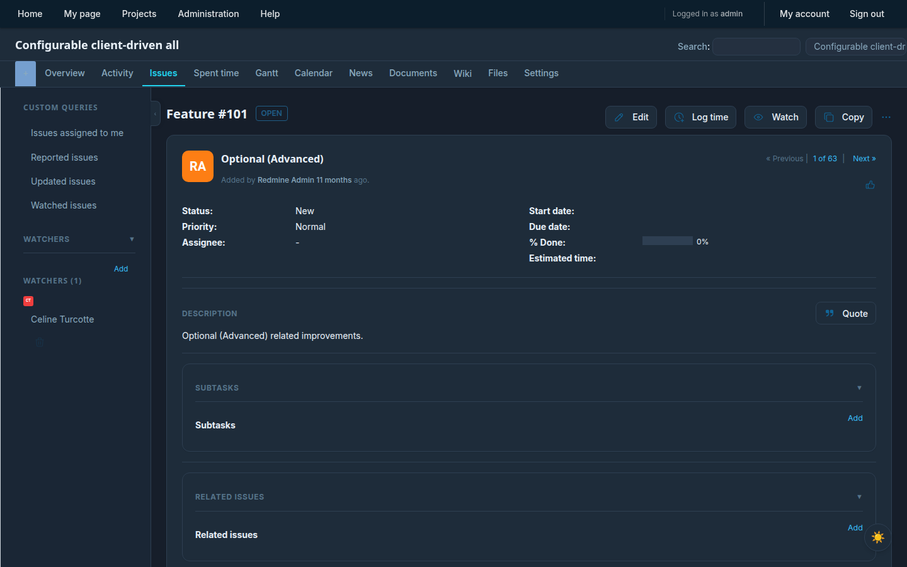

# Modern Redmine Theme

A clean, modern UI theme for Redmine 6 with dark mode, collapsible sidebar, and design tokens.

## Screenshots

### Light Mode




### Dark Mode




## Features

- Dark / light mode toggle (persisted per browser, no flash on load)
- Collapsible left sidebar (persisted per browser)
- Design tokens — change the entire palette by editing 3 lines
- Inter font, modern card layout, smooth transitions
- Toast notifications, collapsible issue sections
- **Zero layout changes required** — drop in and select in Admin settings

## Install

Copy (or symlink) this directory into your Redmine's `themes/` folder:

```bash
cp -r modern-redmine-theme /path/to/redmine/themes/
```

Or clone directly:

```bash
cd /path/to/redmine/themes
git clone <repo-url> modern-redmine-theme
```

Then restart Redmine and go to **Administration → Settings → Display → Theme**, select **Modern redmine theme**, and save.

## Uninstall

Select a different theme (or "Default") in Admin settings, then delete the folder:

```bash
rm -rf /path/to/redmine/themes/modern-redmine-theme
```

## Customise colours

Open `stylesheets/application.css` and edit the tokens near the top of `:root`:

```css
--c-primary:       #0891B2;  /* accent colour (light mode) */
--c-primary-hover: #0E7490;
--c-topbar-bg:     #083344;  /* top navigation bar */
```

Dark-mode overrides live in the `html.dark-mode { … }` block directly below.

## Compatibility

Tested on Redmine 6.x with Propshaft asset pipeline.

## How it works

Redmine's theme system auto-loads:

| File | How it loads |
|------|-------------|
| `stylesheets/application.css` | Replaces default `application.css` via `stylesheet_link_tag` override |
| `javascripts/theme.js` | Auto-included in `<head>` via `heads_for_theme` helper |

The CSS starts with `@import url('../../application.css')` which pulls in Redmine's default styles before applying overrides, so no Redmine source files are modified.
