# Modern Redmine Theme

A clean, modern UI theme for Redmine 6 with dark mode, collapsible sidebar, and design tokens.

## Performance

The theme is built for speed — it adds **zero render-blocking resources** and imposes no measurable overhead on Redmine's response times:

- **No JavaScript frameworks** — theme.js is plain vanilla JS (~4 KB minified)
- **No runtime CSS-in-JS** — everything is static CSS delivered in a single file
- **Dark mode initialised synchronously** before first paint — no flash of unstyled content, no layout shift
- **CSS custom properties** (design tokens) let the browser resolve the entire palette in one pass — no cascade recalculations at runtime
- **Transitions use `transform` and `opacity`** wherever possible — GPU-composited, never triggering layout or paint

## Features

- Dark / light mode toggle (persisted per browser, no flash on load)
- Collapsible left sidebar (persisted per browser)
- Design tokens — change the entire palette by editing 3 lines
- Inter font (via Google Fonts), modern card layout, smooth transitions
- Toast notifications, collapsible issue sections
- Properly styled jQuery UI modals (watchers, etc.) with full-page overlay
- **Zero layout changes required** — drop in and select in Admin settings

## Install

Copy (or symlink) this directory into your Redmine's `themes/` folder:

```bash
cp -r modern-redmine-theme /path/to/redmine/themes/
```

Or clone directly:

```bash
cd /path/to/redmine/themes
git clone https://github.com/acosonic/redmine-modern-theme modern-redmine-theme
```

Then restart Redmine and go to **Administration → Settings → Display → Theme**, select **Modern redmine theme**, and save.

## Uninstall

Select a different theme (or "Default") in Admin settings, then delete the folder:

```bash
rm -rf /path/to/redmine/themes/modern-redmine-theme
```

## Customise colours

Open `stylesheets/application.css` and edit the tokens near the top of `:root`:

```css
--c-primary:       #0891B2;  /* accent colour (light mode) */
--c-primary-hover: #0E7490;
--c-topbar-bg:     #083344;  /* top navigation bar */
```

Dark-mode overrides live in the `html.dark-mode { … }` block directly below.

## Compatibility

Tested on Redmine 6.x with Propshaft asset pipeline.

## How it works

Redmine's theme system auto-loads:

| File | How it loads |
|------|-------------|
| `stylesheets/application.css` | Replaces default `application.css` via `stylesheet_link_tag` override |
| `javascripts/theme.js` | Auto-included in `<head>` via `heads_for_theme` helper |

The CSS starts with `@import url('../../application.css')` which pulls in Redmine's default styles before applying overrides, so no Redmine source files are modified.

## Built with / References

| Technology | Purpose |
|-----------|---------|
| [Inter](https://rsms.me/inter/) | UI typeface (loaded via Google Fonts) |
| [jQuery UI](https://jqueryui.com/) | Dialog/modal system (bundled with Redmine) |
| [Redmine 6 Theme API](https://www.redmine.org/projects/redmine/wiki/Theme_Development) | `heads_for_theme`, `stylesheet_link_tag` override |
| [CSS custom properties](https://developer.mozilla.org/en-US/docs/Web/CSS/Using_CSS_custom_properties) | Design token system |
| [Puppeteer](https://pptr.dev/) | Screenshot automation for README images |

Design inspired by modern SaaS dashboards (Linear, GitHub, Notion).

## Contributing

Contributions are welcome. Please follow these guidelines:

**Bug reports**
- Open an issue and include your Redmine version, browser, and a screenshot.

**Pull requests**
1. Fork the repo and create a branch: `git checkout -b fix/my-fix`
2. Edit only `stylesheets/application.css` and/or `javascripts/theme.js` — do not modify Redmine core files.
3. Test in both light and dark mode.
4. Test at 1280px and 1440px viewport widths.
5. Keep CSS changes scoped — prefer specific selectors over broad resets.
6. Open a PR with a short description and before/after screenshots if visual.

**Token / colour changes**
- New colour variables belong in the `:root { }` block at the top of `application.css`.
- Dark-mode overrides go in the `html.dark-mode { }` block.
- Do not use hardcoded hex values outside of those two blocks.

**JS changes**
- `theme.js` must keep the synchronous dark-mode early-init block at the very top (before `DOMContentLoaded`) to prevent flash of light mode.

## License

MIT

---

## Screenshots

### Projects & Dashboard

| Light | Dark |
|-------|------|
| 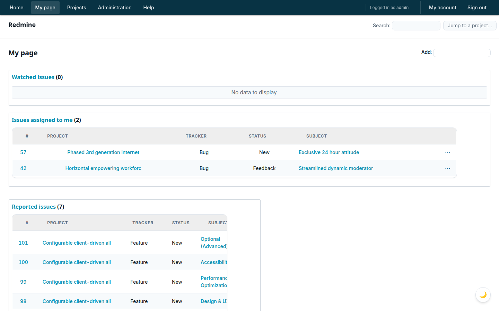 | 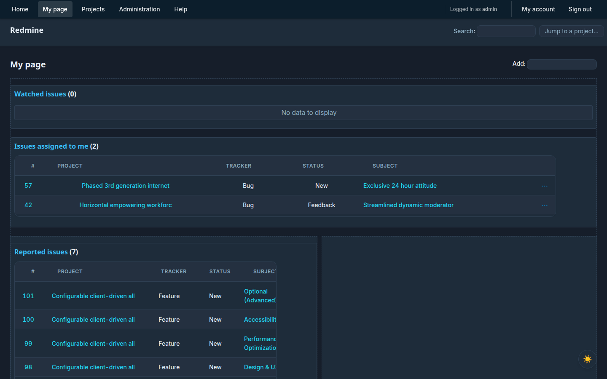 |
|  |  |

### Issues & Filters

| Light | Dark |
|-------|------|
|  |  |
| 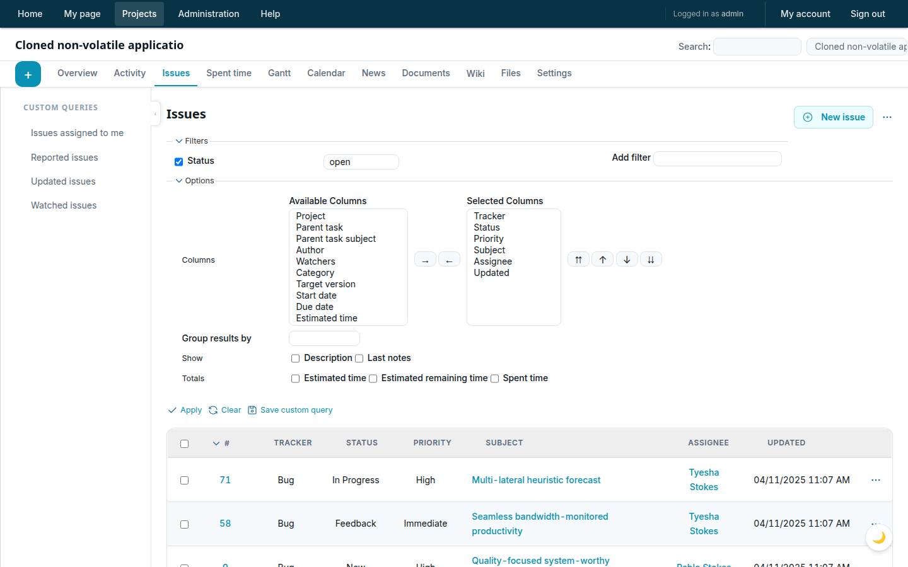 | |

### Issue Detail & Edit

| Light | Dark |
|-------|------|
|  |  |
| 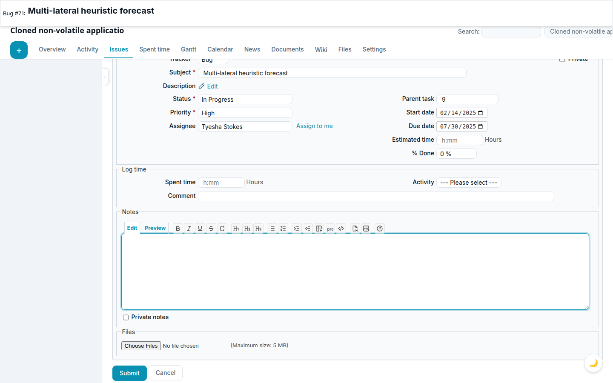 | 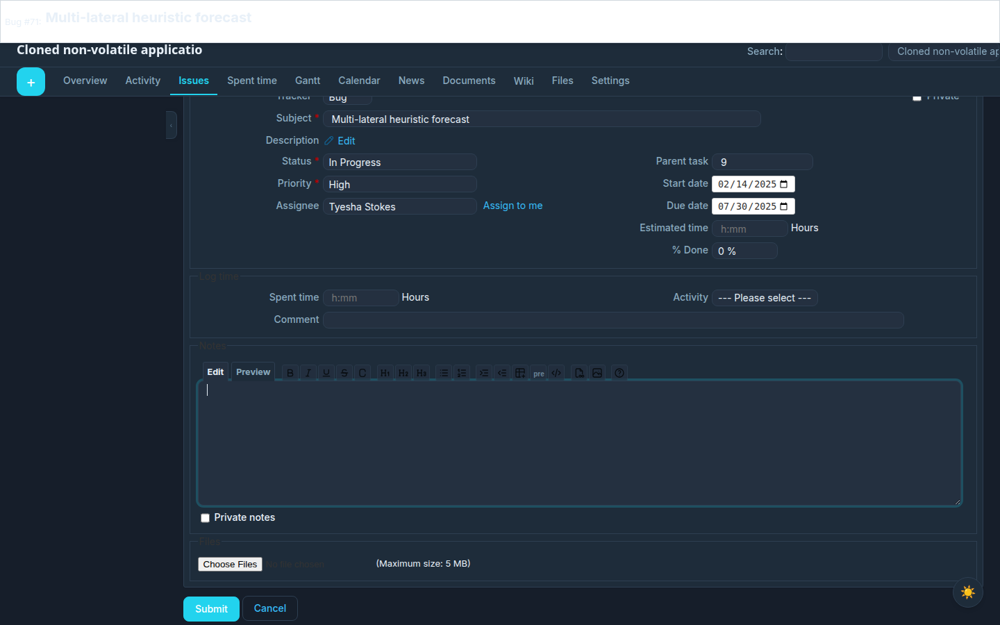 |

### Watchers Modal

| Light | Dark |
|-------|------|
| 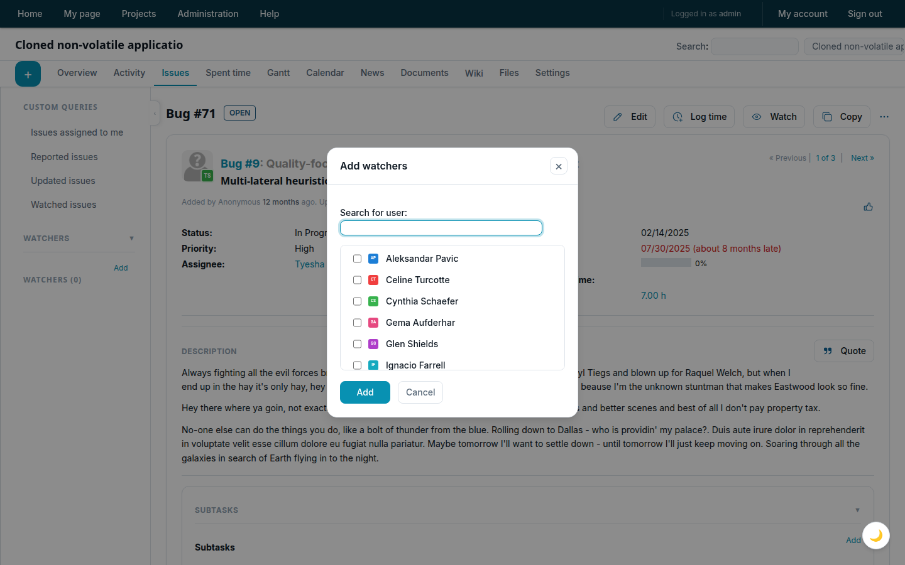 | 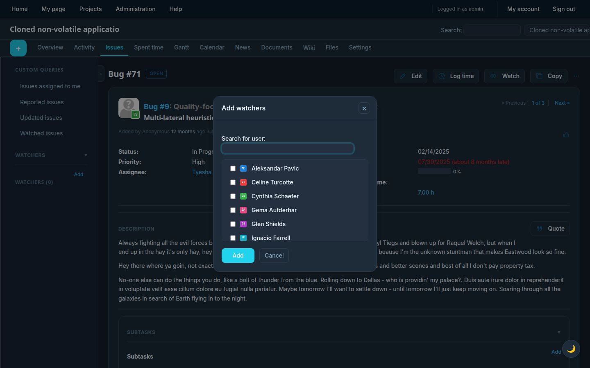 |

### Activity & News

| Light | Dark |
|-------|------|
| 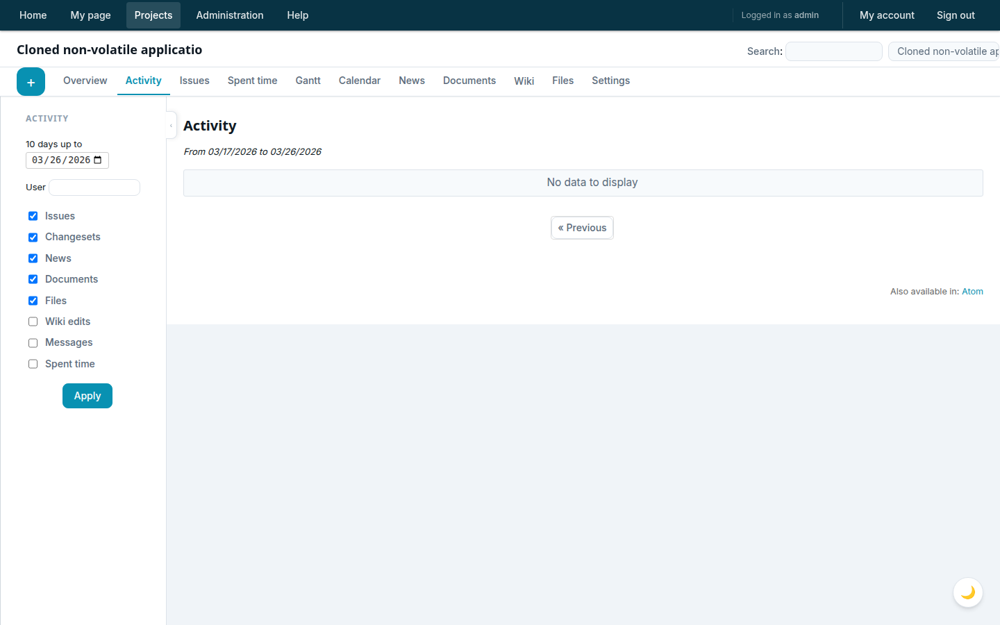 | 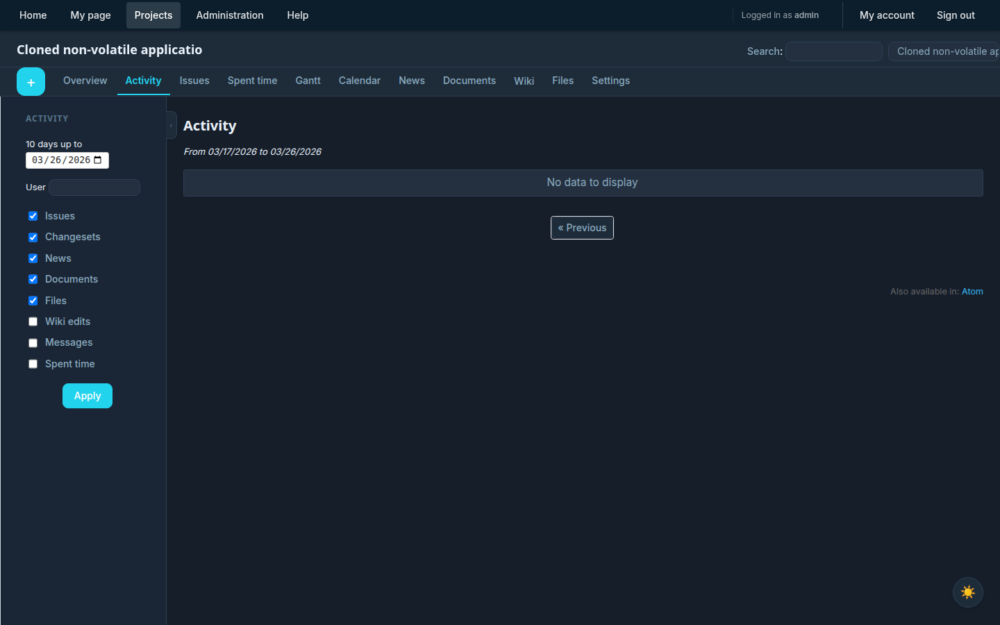 |
| 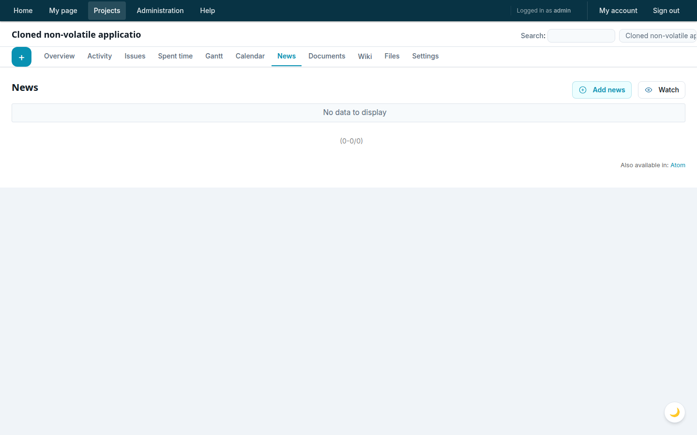 | |

### Project Settings & Administration

| Light | Dark |
|-------|------|
| 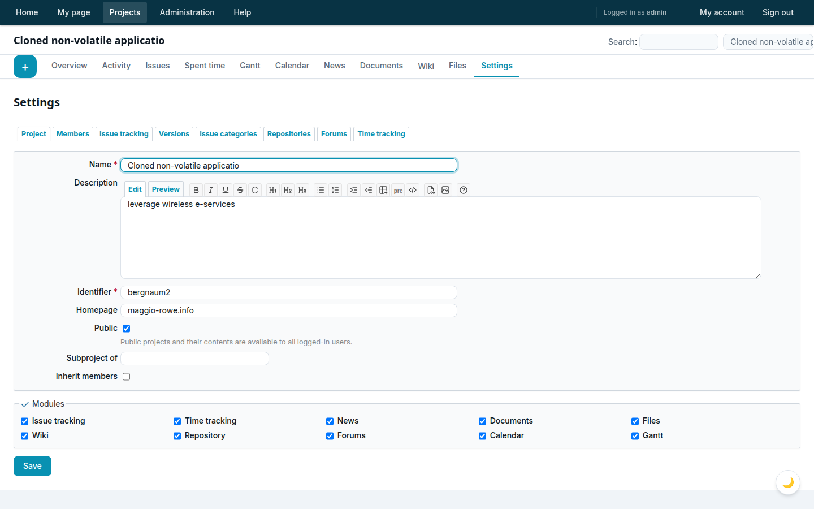 | 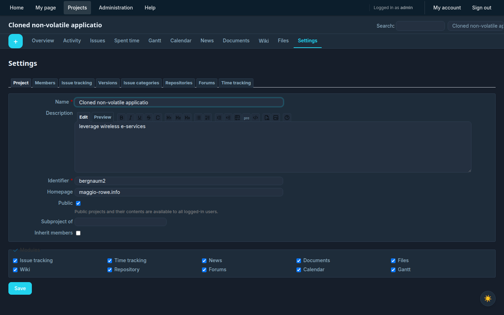 |
| 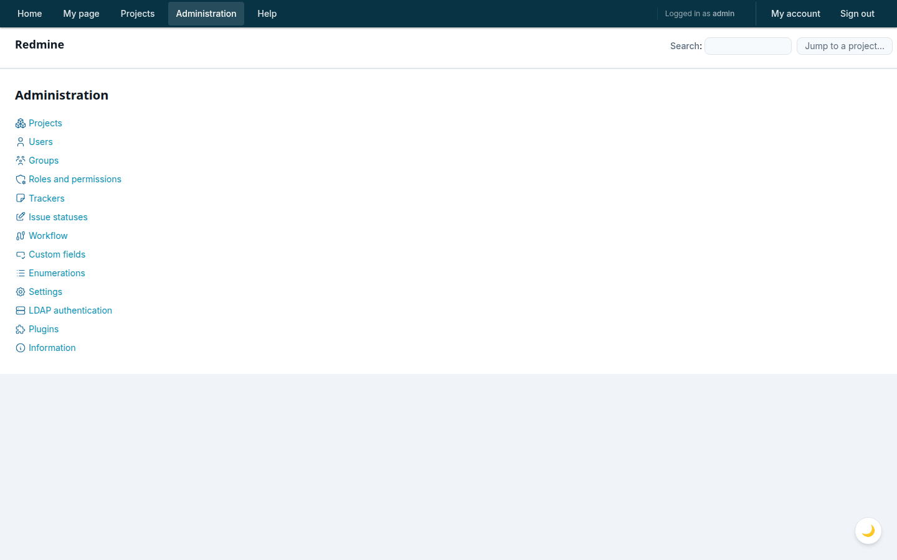 | 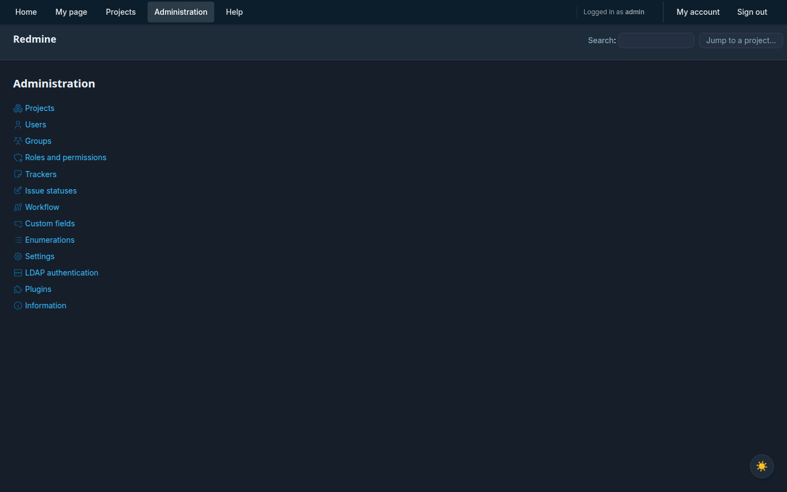 |
| 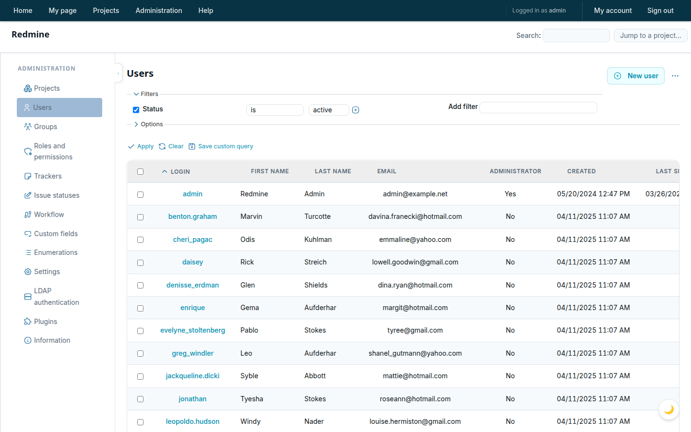 | |
